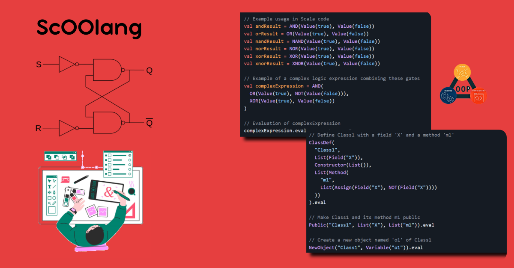

# ScOOlang - SCala based Object-Oriented dsL for logic designers

## Overview
<div style="text-align: justify;">
ScOOlang is a domain-specific language designed specifically for logic gate designers. Initially, this project aimed to explore the inner workings of language constructs and their implementation, particularly in the context of logical expressions commonly used by hardware designers. As the project evolved, its focus shifted to creating a DSL that simplifies the creation and evaluation of complex boolean expressions, enhanced with advanced object-oriented features.
</div>



## Built With

- **Scala 3.2.1** - The programming language used for developing ScOOlang.
- **ScalaTest 3.2.13** - A testing framework for Scala applications.
- **Sbt** - The build tool used for managing dependencies and project tasks.
- **IntelliJ IDEA** - An integrated development environment (IDE) for Scala.

## Prerequisites

Before you begin, ensure you have met the following requirements:

- **JDK 1.8 or above** - Java Development Kit is required for running Scala.
- **Scala 3.2.1 or above** - Ensure you have the appropriate version of Scala installed.

## How to Install

Follow these steps to install ScOOlang in your Scala project:

1. **Download the JAR file:**
    - Download the `ScOOlang.jar` file from the `jar file- (download)` folder.

2. **Add the JAR file as a dependency to your Scala project:**

   a. **If you are using sbt:**
    1. Create a folder named `lib` in the base directory of your project.
    2. Move `ScOOlang.jar` inside the `lib` folder.
    3. In your `build.sbt` file, add the following line:
       ```scala
       Compile / unmanagedJars += baseDirectory.value / "lib" / "ScOOlang.jar"
       ```

   b. **If you are not using sbt and only using an IDE (e.g., IntelliJ):**
    - Manually add the `ScOOlang.jar` file as a dependency to your project.

3. **(Re)build your project.**

4. **Import ScOOlang constructs:**
    - Add the following import statement to your Scala files where you want to use ScOOlang constructs:
      ```scala
      import ScOOlang.lang.constructs._
      ```

## ScOOlang Constructs

ScOOlang offers a comprehensive set of constructs for logic gate designers and object-oriented programming. Below is the complete list of constructs available in ScOOlang:

<details>
<summary>Click to expand list of ScOOlang Constructs</summary>

- [Value](#value)
- [NOT](#not)
- [AND, OR, NAND, NOR, XOR, XNOR](#and-or-nand-nor-xor-xnor)
- [LogicGate](#logicgate)
- [Assign](#assign)
- [Input](#input)
- [Scope](#scope)
- [TestGate](#testgate)
- [getInputVal](#getinputval)
- [ClassDef, Field, Constructor](#insclassdef-field-constructorins)
- [Method](#method)
- [NewObject](#newobject)
- [Variable](#Variable)
- [Public and Private](#public-and-private)
- [AbstractClassDef](#abstractclassdef)
- [InterfaceDef](#interfacedef)
- [ConstantField](#interfacedef)
- [Extend](#extend)
- [ClassName](#extend)
- [InterfaceName](#extend)
- [Implements](#implements)
- [SubstituteObject](#substituteobject)
- [IF, CheckEqual, thenClause, elseClause](#if-checkequal-thenclause-elseclause)
- [ExceptionClassDef, ThrowException](#exceptionclassdef-throwexception)
- [HandleException, Try, Catch](#handleexception-try-catch)
- [Map](#map)

</details>

This sub-section will contain explanations and usage examples for various ScOOlang constructs. Specific constructs can be imported as follows:

```
import ScOOlang.lang._constructName_
```

### <ins>Value</ins>
<details>
<summary>Click to expand</summary>

###### Description
The `Value` construct in ScOOlang represents a boolean value.

###### Signature:
`Value(v: Boolean)`

###### Usage Example
```scala
// Example usage in Scala code
val value1 = Value(false)
val value2 = Value(true)
val andResult = AND(Value(true), Value(false))

// Evaluation of a Value construct will result in a boolean value true or false.
// E.g., the following will result in true
Value(true).eval
```

</details>

---

### <ins>NOT</ins>
<details>
<summary>Click to expand</summary>

###### Description
The `NOT` construct in ScOOlang represents a NOT gate. It takes one parameter, which should be another ScOOlang construct.

###### Signature:
`NOT(i1: constructs)`

###### Usage Example
```scala
// Example usage in Scala code
val g1 = NOT(Value(false))

// Evaluation of g1 can be achieved using the `.eval` method on it.
// E.g., g1.eval will result in true (boolean type).
g1.eval
```
</details>

---


### <ins>AND, OR, NAND, NOR, XOR, XNOR</ins>
<details>
<summary>Click to expand</summary>

###### Description
The constructs `AND`, `OR`, `NAND`, `NOR`, `XOR`, and `XNOR` in ScOOlang are used to create corresponding logic gates. Each of these constructs takes two parameters, which should be other ScOOlang constructs representing boolean values. Their execution results in applying the boolean operation as per their names and returns a Boolean value.

###### Signatures:
`AND(i1: constructs, i2: constructs)`<br>
`OR(i1: constructs, i2: constructs)`<br>
`XOR(i1: constructs, i2: constructs)`<br>
`NAND(i1: constructs, i2: constructs)`<br>
`NOR(i1: constructs, i2: constructs)`<br>
`XNOR(i1: constructs, i2: constructs)`<br>

###### Usage Example
```scala
// Example usage in Scala code
val andResult = AND(Value(true), Value(false))
val orResult = OR(Value(true), Value(false))
val nandResult = NAND(Value(true), Value(false))
val norResult = NOR(Value(true), Value(false))
val xorResult = XOR(Value(true), Value(false))
val xnorResult = XNOR(Value(true), Value(false))

// Example of a complex logic expression combining these gates
val complexExpression = AND(
  OR(Value(true), NOT(Value(false))),
  XOR(Value(true), Value(false))
)

// Evaluation of complexExpression
complexExpression.eval
```

</details>

---

### <ins>LogicGate</ins>
<details>
<summary>Click to expand</summary>

###### Description
The `LogicGate` construct in ScOOlang is used to declare logic expression variables. It takes a `logicVarName` parameter of type `String`.

###### Signature:
`LogicGate(logicName: String)`

###### Usage Example
```scala
// Example usage in Scala code
// To declare and define a logic expression (or logic gates) that is a nested and-or gate
Assign(LogicGate("AndOrGate1"), OR(Input("A"), AND(Input("B"), Input("C"))).eval

// To evaluate a LogicGate
LogicGate("AndOrGate1").eval
```

The `Assign` code line above creates a logic gate variable named "AndOrGate1" and assigns it the logic expression `OR(Input("A"), AND(Input("B"), Input("C")))`, which requires three inputs: 'A', 'B', and 'C'.
<br>
 
 > [!NOTE]
 > + It is required for a `LogicGate` to be assigned a logic expression using the Assign construct before it can be evaluated. 
 > + A declared `LogicGate` construct that is undefined (i.e., hasn’t been assigned a logic expression yet) will throw an error when evaluated.

```scala
// Example of an error when evaluating an undefined LogicGate
val myLogicGate = LogicGate("g1")
myLogicGate.eval  // This will generate an error
```

</details>

---

### <ins>Assign</ins>

<details>
<summary>Click to expand</summary>

###### Description
The `Assign` construct in ScOOlang is responsible for binding variables and values. It can be used to create bindings for various ScOOlang constructs:

###### Signature:
`Assign(varGate: LogicGate | Input | Field | ConstantField, gate: constructs)`

a. **LogicGate construct:**
- `Assign` can bind a `LogicGate` to a ScOOlang-based logical expression.

  ###### Usage Example
   ```scala
   // Example usage in Scala code
   Assign(LogicGate("OrGate1"), OR(Input("A"), Input("B"))).eval
   ```
b. **Input construct:**
- `Assign` can bind/assign the `Input` of a `LogicGate` to a `Value`, an immediately evaluatable logic expression, or another `LogicGate`.

  ###### Usage Example
   ```scala 
   // Example usage in Scala code
   Assign(LogicGate("OrGate1"), OR(Input("A"), Input("B"))).eval
   Scope(
       LogicGate("OrGate1"),
       List(Assign(Input("A"), Value(false))),
       Assign(Input("B"), Value(true))
   ).eval
   ```

c. **Field construct:**
- `Assign` can bind/assign a `Field` construct, which belongs to a class or an object, to a `Value`, or an immediately evaluatable logic expression.

   ###### Usage Example
   ```scala
   // Example usage in Scala code
   ClassDef(
       "Class1",
       List(Field("X"), Field("Y")),
       Constructor(
           List(
               Assign(Field("X"), Value(false)),
               Assign(Field("Y"), Value(true))
           )
       ),
       List(
           Method("m1",
               List(
                   Assign(Field("X"), NOT(Field("X"))),
                   Input("x")
               ),
               List(
                   Assign(Input("x"), Value(false))
               )
           ),
           Method("m2",
               List(
                   AND(Field("X"), Field("Y"))
               ),
               List(
                   Assign(Input("y"), Value(true))
               )
           )
       )
   ).eval
   ```

    + Note: Check more about unknown constructs in the ClassDef section.

d. **ConstantField construct:**
- `Assign` can bind/assign a `ConstantField` construct, which belongs to an interface, to a `Value`.

   ###### Usage Example
   ```scala
   // Example usage in Scala code
   InterfaceDef(
       "myInterface1",
       List(ConstantField("X")),
       List(
           Assign(ConstantField("X"), Value(true))
       ),
       List(AbstractMethod("f1"))
   ).eval
   ```   
  Note: Check more about unknown constructs in the InterfaceDef section.

</details>

---

### <ins>Input</ins>
<details>
<summary>Click to expand</summary>

###### Description
The `Input` construct in ScOOlang is used to provide inputs to define a `LogicGate` expression.

###### Signature:
`Input(iName: String)`


###### Usage Example
```scala
// Example usage in Scala code
// This code creates a LogicGate named AndGate and binds it to an AND construct which takes 2 inputs- Input 'A' and Input 'B' 
val g = Assign(LogicGate("AndGate"), AND(Input("A"), Input("B")))
g.eval

// To assign value to Input
Scope(
    LogicGate("AndGate"),
    List(
        Assign(Input("A"), Value(true)),
        Assign(Input("B"), Value(false))
    )
).eval
```
<br>

 > [!NOTE]
 > + It is required that while using `Input` in a logical expression, it should be associated with a `LogicGate`. 
 > + This ensures that similarly named inputs can be defined for different `LogicGate`s. It also allows for changing these input signals as required during the flow of the code.
<br>

###### Example
```scala
// Example usage in Scala code
// 2 LogicGates named bound to AND constructs which both take 2 inputs- Input 'A' and Input 'B' 
val g1 = Assign(LogicGate("AndGate1"), AND(Input("A"), Input("B")))
val g2 = Assign(LogicGate("AndGate2"), AND(Input("A"), Input("B")))
g1.eval
g2.eval

Scope(
    LogicGate("AndGate1"),
    List(
        Assign(Input("A"), Value(true)),
        Assign(Input("B"), Value(false))
    )
).eval

Scope(
    LogicGate("AndGate2"),
    List(
        Assign(Input("A"), Value(true)),
        Assign(Input("B"), LogicGate("AndGate1"))
    )
).eval
```

+ See Scope to understand more about the above example.

</details>

---

### <ins>Scope</ins>
<details>
<summary>Click to expand</summary>

###### Description
The `Scope` construct in ScOOlang allows for assigning multiple input fields for one `LogicGate` or for multiple logic gates at once.

###### Signature: 
`Scope(gate: LogicGate, exprs: List[constructs])`

###### Usage Example
```scala
// Example 1: Assigning Input fields for a single LogicGate
val g = Assign(LogicGate("AndGate"), AND(Input("A"), Input("B")))
g.eval
Scope(
    LogicGate("AndGate"),
    List(
        Assign(Input("A"), Value(true)),
        Assign(Input("B"), Value(false))
    )
).eval


// Example 2: Assigning Input fields for multiple LogicGates
val g1 = Assign(LogicGate("AndGate1"), AND(Input("A"), Input("B")))
val g2 = Assign(LogicGate("AndGate2"), AND(Input("A"), Input("B")))
g1.eval
g2.eval
Scope(
  LogicGate("AndGate1"),
  List(
    Assign(Input("A"), Value(true)),
    Assign(Input("B"), Value(false)),
    Scope(
      LogicGate("AndGate2"),
      List(
        Assign(Input("A"), Value(true)),
        Assign(Input("B"), LogicGate("AndGate1"))
      )
    )
  )
).eval

```

   + Unlike scopes in general-purpose programming languages, ScOOlang's Scope does not define a start and end to a scope block.
   + Instead, it allows for nesting and managing the assignment of inputs across multiple LogicGates dynamically during evaluation.

</details>

---

### <ins>TestGate</ins>
<details>
<summary>Click to expand</summary>

###### Description
The `TestGate()` construct in ScOOlang is used to check if a `LogicGate` evaluates to a particular boolean value or not.

###### Signature: 
`TestGate(gateName: String, checkVal: Boolean): Boolean`

###### Usage Example
```scala
// TestGate should result true for the below code  
Assign(LogicGate("NotGate"), NOT(Value(true))).eval
TestGate("NotGate", false)
```

   + `TestGate` is a method itself and does not require invoking any additional method like .eval. It directly checks whether the LogicGate named NotGate evaluates to false.

</details>

---

### <ins>getInputVal()</ins>
<details>
<summary>Click to expand</summary>

###### Description
The `getInputVal()` method in ScOOlang is used to fetch/get input values associated with a `LogicGate`, provided that the input value can be evaluated to a Boolean value.

###### Signature:
`getInputVal(logicName: String, varName: String): Boolean`

###### Usage Example
```scala
// Example usage in Scala code
// Assigning Input fields for a single LogicGate
val g = Assign(LogicGate("AndGate"), AND(Input("A"), Input("B")))
g.eval

val A = getInputVal("AndGate", "A")
```

+ In the example above, `getInputVal("AndGate", "A")` fetches the current Boolean value associated with the input variable "A" of the `LogicGate` named "AndGate". This method is useful for retrieving and using the current state of input variables within logical expressions.

</details>

---

### <ins>ClassDef, Field, Constructor</ins>
<details>
<summary>Click to expand</summary>

###### Description
The `ClassDef()` construct in ScOOlang is used to create a user-defined class.

###### Signature
`ClassDef(className: String, fields: List[Field], constructor: Constructor, methods: List[Method])`

###### Usage Example
```scala
// Example usage in Scala code
// This will create a class named ‘Class1’ with 2 fields ‘X’ and ‘Y’, a constructor, and two methods 'm1' and 'm2'
// See how fields for a class are created in the second parameter List of the ClassDef and later used inside the constructor and methods
ClassDef(
    "Class1",
    List(Field("X"), Field("Y")),
    Constructor(
        List(
            Assign(Field("X"), Value(false)),
            Assign(Field("Y"), Value(true))
        )
    ),
    List(
        Method(
            "m1",
            List(
                Assign(Field("X"), NOT(Field("X"))),
                Input("x")
            ),
            List(
                Assign(Input("x"), Value(false))
            )
        ),
        Method(
            "m2",
            List(
                AND(Field("X"), Field("Y"))
            ),
            List(
                Assign(Input("y"), Value(true))
            )
        )
    )
).eval
```
+ A class defined using `ClassDef` can later be instantiated using the `NewObject` construct.
+ The `Field` construct in ScOOlang is used to define a field inside a class. Fields can be associated with boolean values.
+ Fields defined using `Field` can be accessed and manipulated within class methods. When a method is invoked on an object, the field references within the method refer to the specific instance's field values. In cases where inheritance is involved, fields may also reference values from parent classes.
+ The `Constructor` construct defines the constructor of a class, which is invoked automatically when an object of that class is created. `Constructor`s are used to initialize field variables within the class.
<br>

  > [!NOTE]
  > + By default, all field variables are initialized to false.

<br>

</details>

---

### <ins>Method</ins>
<details>
<summary>Click to expand</summary>

###### Description
The `Method()` construct in ScOOlang is used to define methods within a Class or an Abstract Class.

###### Signature
`Method(mName: String, exprs: List[constructs], params: List[Assign])`
- `mName`: Name of the class method.
- `exprs`: Expressions that should be evaluated when the method is called.
- `params`: List of `Assign` constructs to create parameters that this method will take when invoked.

###### Usage Example
```scala
// Example usage in Scala code
// Class1 defined with method m1. When invoked from an object of this class with input param ‘x’, 
// its first statement will invert the value of Field ‘X’ of the class and the next statement will evaluate 
// the result of AND of Input ’x’ and Field ‘X’.
ClassDef(
    "Class1",
    List(Field("X")),
    Constructor(List()),
    List(
        Method(
            "m1",
            List(
                Assign(Field("X"), NOT(Field("X"))),
                AND(Input("x"), Field("X"))
            ),
            List(
                Assign(Input("x"), Value(false))
            )
        )
    )
).eval
```

   + Methods defined using Method() can be invoked from an object. When invoked, a method returns a boolean value equivalent to the evaluation of its last statement.
   + Internal class fields with any access modifiers (private, public) can be utilized within a method.
   + Additionally, inherited fields with public access modifiers can also be utilized within a method.

</details>

---

### <ins>NewObject</ins>
<details>
<summary>Click to expand</summary>

###### Description
The `NewObject` construct in ScOOlang is used to create objects of a previously defined concrete class.

###### Signature
`NewObject(className: String, v: Variable)`
- `className`: Name of the class for which an object is being created.
- `v`: Variable representing the object instance.

###### Usage Example
```scala
// Example usage in Scala code
// Define Class1 with a field 'X' and a method 'm1'
ClassDef(
  "Class1",
  List(Field("X")),
  Constructor(List()),
  List(Method(
    "m1",
    List(Assign(Field("X"), NOT(Field("X"))))
  ))
).eval

// Make Class1 and its method m1 public
Public("Class1", List("X"), List("m1")).eval

// Create a new object named 'o1' of Class1
NewObject("Class1", Variable("o1")).eval
```

   + When an object is created using `NewObject`, the constructor of the corresponding class (Class1 in this example) gets automatically invoked.

</details>

---

### <ins>Variable</ins>
<details>
<summary>Click to expand</summary>

###### Description
The `Variable` construct in ScOOlang is used to refer to and utilize an existing object of a defined class.

###### Signature
`Variable(objName: String)`
- `objName`: Name of the object instance.

###### Usage Example
```scala
// Example usage in Scala code
// Define Class1 with a field 'X' and a method 'm1'
ClassDef(
  "Class1",
  List(Field("X")),
  Constructor(List()),
  List(Method(
    "m1",
    List(
      AND(Input("x"), NOT(Field("X")))
    ),
    List(
      Assign(Input("x"), Value(false))
    )
  ))
).eval

// Make Class1 and its method m1 public
Public("Class1", List("X"), List("m1")).eval

// Create a new object named 'o1' of Class1
NewObject("Class1", Variable("o1")).eval
```
Methods Associated with Variable
   1. **InvokeField()**: Used to get/fetch a field value.
    
      ###### Signature:
      `InvokeField(fieldName: String)`
      ###### Example:
      `Variable("o1").InvokeField("X")`

   2. **InvokeMethod()**: Used to invoke a method for the specified object.

       ###### Signature:
       `InvokeMethod(methodName: String, params: List[Assign])`
       ###### Example:
       `// Invoke method 'm1' for the object 'o1' with the parameter assignment`
       `Variable("o1").InvokeMethod("m1", List(Assign(Input("x"), Value(true))))`

   + When using `Variable`, you can refer to existing objects of a defined class and utilize their fields and methods using the associated methods InvokeField() and InvokeMethod().

</details>

---

### <ins>Public and Private</ins>
<details>
<summary>Click to expand</summary>

###### Description
The `Public` and `Private` constructs in ScOOlang are used to restrict access to fields and methods of a class (concrete or abstract). They act as access modifiers, similar to those in general-purpose programming languages.

###### Signature
`Public: Public(className: String, fieldNameList: List[String], methodNameList: List[String])'
Private: Private(className: String, fieldNameList: List[String], methodNameList: List[String])`<br>

  > [!NOTE]
  >+ By default, no access modifier is applied to any field or method.
  >+ Access modifiers need to be explicitly defined by the user using the above-mentioned constructs.
  <br>

  1. **Public**
     Fields and methods of a class can be defined as Public using the Public() construct.
     ###### Usage Example
       ```scala
       // Define Class1 with a field 'X' and a method 'm1'
       ClassDef(
         "Class1",
         List(Field("X")),
         Constructor(List()),
         List(Method(
           "m1",
           List(
             AND(Input("x"), NOT(Field("X")))
           ),
           List(
             Assign(Input("x"), Value(false))
         )
         ))
       ).eval
       
       // Make Class1 and its method m1 public
       Public("Class1", List("X"), List("m1")).eval
       ```

        + `Public` fields and methods can be accessed directly via an object of a class (See `InvokeField()` and `InvokeMethod()` sections for more details).
        + These fields and methods are also subject to inheritance by child classes.

  2. **Private**
       Fields and methods of a class can be defined as Private using the `Private` construct.
       ###### Usage Example
     ```scala
         // Define Class1 with a field 'X' and a method 'm1'
         ClassDef(
           "Class1",
           List(Field("X")),
           Constructor(List()),
           List(Method(
             "m1",
             List(
               AND(Input("x"), NOT(Field("X")))
             ),
             List(
               Assign(Input("x"), Value(false))
             )
           ))
         ).eval
       
         // Make Class1 and its method m1 private
         Private("Class1", List("X"), List("m1")).eval
     ```

     + Private fields and methods can be accessed only from within the class.
     + These fields and methods **cannot** be invoked by class objects and cannot be inherited by child classes.

</details>

---

### <ins>AbstractClassDef</ins>
<details>
<summary>Click to expand</summary>

###### Description
The `AbstractClassDef()` construct in ScOOlang is used to create a user-defined abstract class.

###### Signature
`AbstractClassDef(className: String, fields: List[Field], constructor: Constructor, concreteMethods: List[Method], abstractMethods: List[AbstractMethod])`
- `className`: The name of the abstract class.
- `fields`: A list of fields for the abstract class.
- `constructor`: The constructor for the abstract class.
- `concreteMethods`: A list of concrete methods for the abstract class.
- `abstractMethods`: A list of abstract methods for the abstract class.

###### Usage Example
```scala
// Create an abstract class named absClass1. It has a Field 'X', a concrete method 'abc1', and an abstract method 'f'.
AbstractClassDef(
  "absClass1", 
  List(Field("X")), 
  Constructor(List(Assign(Field("X"), Value(true)))), 
  List(Method("abc1", List(Value(true)), List())), 
  List(AbstractMethod("f"))
).eval
```

   + In addition to the features that exist in a concrete class, an abstract class can accommodate abstract methods which do not need definitions.
   + `AbstractMethod` constructs should be used inside `AbstractClassDef` and `InterfaceDef` to define abstract method names. Parameters will be given while defining a concrete method by the class that inherits corresponding abstract method.
   + Concrete classes that extend an abstract class need to provide definitions for the inherited abstract methods.

      ###### Example
      ```scala
      // Create an abstract class named absClass1. It has a Field 'X', a concrete method 'abc1', and an abstract method 'f'.
      // Define a concrete class that extends an abstract class and provides definitions for inherited abstract methods.
      ClassDef("absChildClass1", List(), Constructor(List()), List(Method("g", List(Value(false)), List()))).eval
      Public("absChildClass1", List(), List("g")).eval
      Extend(ClassName("absChildClass1"), ClassName("absClass1")).eval
      ```

   + It is possible for an abstract class to extend another abstract class.
      ###### Usage Example
      ```scala
      AbstractClassDef(
        "absClass1", 
        List(Field("X")), 
        Constructor(List(Assign(Field("X"), Value(true)))), 
        List(Method("abc1", List(Value(true)), List())), 
        List(AbstractMethod("f"))
      ).eval

      AbstractClassDef(
        "absClass2", 
        List(Field("Y")), 
        Constructor(List(Assign(Field("Y"), Value(true)))), 
        List(Method("f", List(Value(false)), List())), 
        List(AbstractMethod("g"))
      ).eval

      Public("absClass1", List("X"), List("abc1")).eval
      Public("absClass2", List("Y"), List("f")).eval
      Extend(ClassName("absClass2"), ClassName("absClass1")).eval
      ```

   + It is not possible to instantiate objects for an abstract class, and doing so will lead to an exception.

</details>

---

### <ins>InterfaceDef</ins>
<details>
<summary>Click to expand</summary>

###### Description
The `InterfaceDef()` construct in ScOOlang is used to create a user-defined interface.

###### Signature
`InterfaceDef(iName: String, cFields: List[ConstantField], assigns: List[Assign], abstractMethods: List[AbstractMethod])`
- `iName`: The name of the interface.
- `cFields`: A list of constant fields for the interface.
- `assigns`: A list of assignments for the constant fields.
- `abstractMethods`: A list of abstract methods for the interface.

###### Usage Example
```scala
// Creates an interface named myInterface1. It has a ConstantField 'X' and an abstract method 'f1'.
InterfaceDef(
  "myInterface1",
  List(ConstantField("X")),
  List(Assign(ConstantField("X"), Value(true))),
  List(AbstractMethod("f1"))
).eval
```

   + Fields declared inside an interface are called `ConstantField`. These fields do not have any access modifier. They are inherited by classes that implement the interface.
   + In order for constant fields to be created, they must be assigned a value inside the constructor. Failure to do so will result in the `ConstantField` not getting created.

</details>

---

### <ins>Extend</ins>
<details>
<summary>Click to expand</summary>

###### Description
The `Extend` construct in ScOOlang is responsible for achieving inheritance. It allows either a class (concrete or abstract) to extend another class (concrete or abstract) or an interface to extend another interface.

###### Signature
`Extend(childName: ClassName | InterfaceName, parentName: ClassName | InterfaceName)`

###### Usage Example
```scala
// Suppose that abstractA1, abstractA2, concreteC1, concreteC2, concreteC3 already exist
Extend(ClassName("concreteC2"), ClassName("concreteC1")).eval
Extend(ClassName("abstractA2"), ClassName("abstractA1")).eval
Extend(ClassName("concreteC3"), ClassName("abstractA2")).eval
Extend(InterfaceName("interfaceI2"), InterfaceName("interfaceI1")).eval
```
   + As shown above, `ClassName` constructs are used to refer to both previously defined concrete and abstract classes while using `Extend`.
   + On the other hand, `InterfaceName` constructs are used to refer to a previously defined interface.

   + In the case a concrete class extends an abstract class, it will be required that the concrete class provides definitions for the abstract methods inherited from the abstract class.
   ###### Example
   ```scala
   // As shown below, if childC1 extends absParentA1, it needs to define a method named ‘g’ of its own because it’s an abstract method in the parent class

   AbstractClassDef(
     "absParentA1",
     List(Field("Y")),
     Constructor(List(Assign(Field("Y"), Value(true)))),
     List(Method("f", List(Input("x")), List(Assign(Input("x"), Value(false))))),
     List(AbstractMethod("g"))
   ).eval

   Public("absParentA1", List("Y"), List("f")).eval

   ClassDef(
     "childC1",
     List(),
     Constructor(List()),
     List(Method("g", List(Value(false)), List()))
   ).eval

   Public("childC1", List(), List("g")).eval

   Extend(ClassName("childC1"), ClassName("absParentA1")).eval
   ```
<br>

   > [!NOTE] 
   > + A class **cannot** extend an interface, and similarly, an interface cannot extend a class. Doing so will result in an exception being thrown.
<br>

</details>

---

### <ins>Implements</ins>
<details>
<summary>Click to expand</summary>

###### Description
The `Implements` construct in ScOOlang is used to implement an interface by a (concrete or abstract) class.

###### Signature
`Implements(className: String, interfaceName: String)`

###### Usage Example
```scala
// Assuming Class C1 and interface I1 are already defined
// C1 can be a concrete or an abstract class
Implements("C1", "I1").eval
```
<br>

   > [!NOTE]
   > + It is required that the implementing (concrete or abstract) class provides definitions for the abstract methods of the interface.

</details>

---

### <ins>SubstituteObject</ins>
<details>
<summary>Click to expand</summary>

###### Description
The `SubstituteObject()` construct in ScOOlang is used to change the binding of an already created object. This allows one object to refer to the same memory location as another object or for implementing the concept of substitutivity.

###### Signature
`SubstituteObject(obj1: Variable, obj2: Variable)`
- obj1- object for which the binding needs to be changed
- obj2- new object. After evaluation, obj1 will point to the object at the same memory location as obj2.
- Note: NOTE: either both objects should be of the same class type OR class type of obj1 should be a subtype of obj2

###### Usage Example: When Both Objects are of the Same Type
```scala
//This will change the binding of obj2 so that it now refers to the same object as obj1 in memory.
// Define Class C1 with a Field X and a method m1
ClassDef("C1", List(Field("X")), Constructor(List(Assign(Field("X"), Value(true)))), List(Method("m1", List(Assign(Field("X"), NOT(Field("X")))), List()))).eval
Public("C1", List("X"), List("m1")).eval

// Create two objects o1 and o2 of type C1
NewObject("C1", Variable("o1")).eval
NewObject("C2", Variable("o2")).eval

// Check initial value of Field X for o2
Variable("o2").InvokeField("X") // shouldBe true

// Invoke method m1 on o1
Variable("o1").InvokeMethod("m1", List()) // inverts value of Field X for o1

// Change binding of o2 to refer to the same object as o1
SubstituteObject(Variable("o2"), Variable("o1")).eval

// Now o2 should reflect the changes made to o1
Variable("o2").InvokeField("X") // this should now return false
```

   + In addition to the features that exist in a concrete class, an abstract class can accommodate abstract methods which do not need definitions.
   + Concrete classes that extend an abstract class need to provide definitions for the inherited abstract methods.

###### Usage Example: When obj1 is a Subtype of obj2
```scala
// Define childClass1 and parentClass1
ClassDef("childClass1", List(Field("X")), Constructor(List(Assign(Field("X"), Value(true)))), List(Method("m1", List(Field("X")), List()))).eval
ClassDef("parentClass1", List(Field("Y")), Constructor(List(Assign(Field("Y"), Value(false)))), List(Method("m1", List(Field("Y")), List()))).eval
Public("childClass1", List("X"), List("m1")).eval
Protected("parentClass1", List("Y"), List("m1")).eval

// Extend childClass1 from parentClass1
Extend(ClassName("childClass1"), ClassName("parentClass1")).eval

// Create objects of childClass1 and parentClass1
NewObject("childClass1", Variable("childObject1")).eval
NewObject("parentClass1", Variable("parentObject1")).eval

// Change binding of parentObject1 to refer to the childObject1
SubstituteObject(Variable("parentObject1"), Variable("childObject1")).eval

// Invoking method m1 on parentObject1 should now call the method from childClass1
Variable("parentObject1").InvokeMethod("m1", List()) // should return true
```

   + When an object of the parent class is substituted by an object of the child class, invoking a method on the parent object will call the overridden method in the child object.

</details>

---

### <ins>IF, CheckEqual, thenClause, elseClause</ins>
<details>
<summary>Click to expand</summary>

###### Description
The `IF` construct in ScOOlang is used to run a block of code based on a `CheckEqual` condition.

###### Signature
`IF(condition: CheckEqual, thenClause: List[constructs], elseClause: List[constructs])`
- CheckEqual: A condition to evaluate.
- thenClause: A list of expressions to execute if the condition is true.
- elseClause: A list of expressions to execute if the condition is false.

###### Usage Example
```scala
// The CheckEqual will evaluate to true, thus the thenClause will be run, resulting in the creation of NotGate1 and AndGate1.
IF(
  CheckEqual(NOT(Value(false)), NOT(NOT(Value(true)))),
  List(
    Assign(LogicGate("NotGate1"), NOT(Input("A"))),
    Assign(LogicGate("AndGate1"), AND(Input("A"), Input("B")))
  ),
  List(
    Assign(LogicGate("OrGate1"), OR(Input("A"), Input("B")))
  )
).eval
```

#### <ins>CheckEqual</ins>
###### Description
The CheckEqual construct checks the equality of the evaluation of two logic gates. It returns true if the evaluation results are the same, otherwise, it returns false.

###### Signature
CheckEqual(i1: constructs, i2: constructs)

###### Usage Example
   ```scala
   //should result in false
   CheckEqual(NOT(Value(false)), NOT(NOT(Value(false)))).eval
   ```

   + thenClause and elseClause constructs are associated with the IF construct.
   + If the CheckEqual conditional construct evaluates to true, the thenClause associated with the IF construct will get executed.
   + If the CheckEqual conditional construct evaluates to false, the elseClause associated with the IF construct will get executed.

</details>

---

### <ins>ExceptionClassDef, ThrowException</ins>
<details>
<summary>Click to expand</summary>

###### Description
The `ExceptionClassDef` construct declares a user-defined exception class in ScOOlang. Once defined, this exception class can be used to throw custom exceptions using the `ThrowException` construct.

###### Signature
`ExceptionClassDef(exClassName: String)`

###### Usage Example
```scala
//Declares an exception class named ExceptionClass1
ExceptionClassDef("ExceptionClass1").eval

// Handle an exception of type ExceptionClass1
HandleException(
  "ExceptionClass1",
  Try(
    List(
      IF(
        CheckEqual(AND(Value(true), Value(false)), OR(Value(true), Value(false))),
        List(
          Assign(LogicGate("NotGate4"), NOT(Input("A")))
        ),
        List(
          Assign(LogicGate("AndGate4"), AND(Value(true), Value(true))),
          ThrowException("ExceptionClass1", "Check failed!"),
          Assign(LogicGate("OrGate4"), OR(Value(true), Value(false)))
        )
      )
    )
  ),
  Catch(
    List(
      Assign(LogicGate("NotGate5"), NOT(Value(false)))
    )
  )
).eval
```
  <div style="text-align: justify;">
  This code snippet demonstrates the declaration of an exception class ExceptionClass1 and the handling of an exception within a Try block. Inside the Try block, an IF statement checks a condition using CheckEqual. If the condition is true, it executes certain assignments; otherwise, it throws an exception of type ExceptionClass1 with the message "Check failed!". The exception is caught in the Catch block, where a fallback assignment (Assign(LogicGate("NotGate5"), NOT(Value(false)))) is performed.
  </div>

#### **ThrowException**
###### Description
The `ThrowException` construct allows throwing an exception of a specified exception class with an associated message.
###### Signature
ThrowException(exClassName: String, reason: String)
- exClassName: The name of the exception class to throw.
- reason: A string message describing the reason for throwing the exception.

###### Usage Example
   ```scala
   //Throwing an exception of type ExceptionClass1 with the message "Check failed!".
   ThrowException("ExceptionClass1", "Check failed!").eval
   ```

</details>

---

### <ins>HandleException, Try, Catch<ins>
<details>
<summary>Click to expand</summary>

###### Description
Handles exceptions (for a previously defined Exception Class) thrown within a `Try` block and specifies actions to take in case of an exception.

###### Signature
`HandleException(exClassName: String, tryBlock: Try, catchBlock: Catch)`

###### Usage Example
```scala
// Declares an exception class and sets up exception handling
ExceptionClassDef("ExceptionClass1").eval

// Handles exceptions of type ExceptionClass1
HandleException("ExceptionClass1",
  Try(
    List(
      IF(
        CheckEqual(AND(Value(true), Value(false)), OR(Value(true), Value(false))),
        List(
          Assign(LogicGate("NotGate4"), NOT(Input("A")))
        ),
        List(
          Assign(LogicGate("AndGate4"), AND(Value(true), Value(true))),
          ThrowException("ExceptionClass1", "Check failed!"),
          Assign(LogicGate("OrGate4"), OR(Value(true), Value(false)))
        )
      )
    )
  ),
  Catch(
    List(
      Assign(LogicGate("NotGate5"), NOT(Value(false)))
    )
  )
).eval
```

    <div style="text-align: justify;">
   During exception handling, the Try block executes sequentially, allowing all statements within it to run normally unless an exception is triggered using the ThrowException() construct. If an exception is thrown, execution skips any subsequent statements in the Try block and transfers control to the corresponding Catch block. The Catch block then handles the exception by executing its defined statements.
   </div>  

#### **Try**
###### Description
Encloses a block of expressions where exceptions may occur and should be handled.
###### Signature
`Try(exprs: List[constructs])`

#### **Catch**
###### Description
Defines a block of expressions to handle exceptions thrown by a ThrowException() within a corresponding Try() block.
###### Signature
`Catch(exprs: List[constructs])`

</details>

---

### <ins>Map()</ins>
<details>
<summary>Click to expand</summary>

###### Description
MAP() is a monadic function used to optimize boolean expressions by applying a transformer function to simplify them. It supports both partial and complete evaluation based on the transformer function and existing input values.

###### Usage Example: Complete Evaluation
```scala
Assign(LogicGate("OrGate"), OR(Input("A"), Input("B"))).eval

// Evaluating without using MAP()
assert(LogicGate("OrGate").eval == OR(Input("A"), Value(true)))

// Using MAP() with a transformer function
val func1: constructs => constructs = {
  case OR(_, Value(true)) => Value(true)
  case OR(Value(true), _) => Value(true)
  case expr => expr
}

val x = LogicGate("OrGate").MAP(func1)
assert(x == Value(true))
```

###### Usage Example: Parital Evaluation
```scala
Assign(LogicGate("composite1"), AND(Input("A"), OR(Input("B"), Input("C")))).eval
Scope(LogicGate("composite1"), List(Assign(Input("B"), Value(true)))).eval

// Evaluating without using MAP()
// assert(LogicGate("composite1").eval == AND(Input("A"), OR(Value(true), Input("C"))))

// Using MAP() with a transformer function
val func1: constructs => constructs = {
  case OR(_, Value(true)) => Value(true)
  case OR(Value(true), _) => Value(true)
  case expr => expr
}

val x = LogicGate("composite1").MAP(func1)
assert(x == AND(Input("A"), Value(true)))
```

   + MAP() facilitates the optimization of logical expressions by transforming them according to predefined rules, allowing for more efficient evaluation.
   + MAP() can also simplify LogicGate expressions within an IF() block by evaluating logical expression statements inside its thenClause() and elseClause().

</details>

---

### <ins>Help with Exceptions/Errors</ins>

Here are the details and improved error messages for handling exceptions and errors in your system:

1. **"Undefined gate being evaluated!"**
    - Error occurs when attempting to evaluate a non-existent logic gate.
    - Example: `LogicGate("someGate").eval`

2. **"Input to logic gate must be a logic gate and cannot be an Assign!"**
    - Error occurs if an `Assign()` construct is used inside a boolean expression and is evaluated.
    - Example: `NOT(Assign(LogicGate("logicGate1"), NOT(Value(true)))).eval`

3. **"Input to logic gate must be a logic gate and cannot be a Scope!"**
    - Error occurs if a `Scope()` construct is used inside a boolean expression and is evaluated.
    - Example: `NOT(Scope(LogicGate("logicGate1"), List(Assign(Input("A"), Value(true))))).eval`

4. **"Input assignment must be done within a scope of some logic gate!"**
    - Error occurs when trying to `Assign` an `Input` without being scoped under a logic gate.
    - Example: `Assign(Input("A"), Value(true)).eval`

5. **"No Field(s) exists!"**
    - Error occurs when attempting to assign or evaluate a non-existing field of a class from its constructor or method.

6. **"Field assignment must be done within a class constructor or a member function!"**
    - Error occurs when attempting to assign a field outside of a class constructor or method.

7. **"Multiple inheritance not allowed!"**
    - Error occurs if a child class tries to extend more than one class.

8. **"Incompatible objects!"**
    - Error occurs when attempting to substitute an object with another object that is not of the same class or its parent class.

9. **"InvokeMethod can only be called on Variable() objects!"**
    - Error occurs if `InvokeMethod()` is called on a data type other than `Variable`.

10. **"InvokeField can only be called on Variable() objects!"**
    - Error occurs if `InvokeField()` is called on a data type other than `Variable`.

11. **"Undefined object!"**
    - Error occurs when referencing an undefined object.

12. **"Undefined gate being evaluated!"**
    - Error occurs when evaluating a non-existent logic gate.

13. **"Undefined Class!"**
    - Error occurs when referencing an undefined class.

14. **"Similar named object already exists!"**
    - Error occurs when creating an object with a name that already exists.

15. **"No such field(s) exists!"**
    - Error occurs when assigning an access modifier to non-existing fields of a class.

16. **"No such method exists!"**
    - Error occurs when assigning an access modifier to non-existing methods of a class.

17. **"Field already declared as public"**
    - Error occurs when attempting to redeclare a field with an access modifier.

18. **"Method already declared as public"**
    - Error occurs when attempting to redeclare a method with an access modifier.

19. **"No such methods exist! or method is neither public nor protected!"**
    - Error occurs when invoking a method that does not exist or is not accessible.

20. **"No such field exists! or field is neither public nor protected!"**
    - Error occurs when accessing a field that does not exist or is not accessible.

21. **"Undefined Interface!"**
    - Error occurs when extending an undefined interface.

22. **"Interface cannot extend a Class!"**
    - Error occurs when trying to extend a class from an interface.

23. **"Class cannot extend an interface!"**
    - Error occurs when trying to extend an interface from a class.

24. **"Some abstract Class Methods are undefined!"**
    - Error occurs when not all abstract methods of an abstract class are overridden by the child class that extends it.

25. **"Cyclic Inheritance not allowed!"**
    - Error occurs when cyclic inheritance is detected.

26. **"Cannot instantiate an abstract class!"**
    - Error occurs when attempting to instantiate an abstract class.

27. **"Similar named Exception Class already exists!"**
    - Error occurs when creating an exception class with a name that already exists.

28. **"Exception Class already handled!"**
    - Error occurs when handling an exception class that has already been handled before.

29. **"LogicGate evaluated only partially!"**
    - Error occurs when using `TestGate(gateName, boolean)` to compare the evaluation of a logic gate with a boolean value, resulting in partial evaluation.

These error messages help in debugging and handling various scenarios within the system effectively.

---

## Need Help?

Reach out to me!

**Email:** [punit.malpani@gmail.com](mailto:punit.malpani@gmail.com)


Don't hesitate to contact us!


